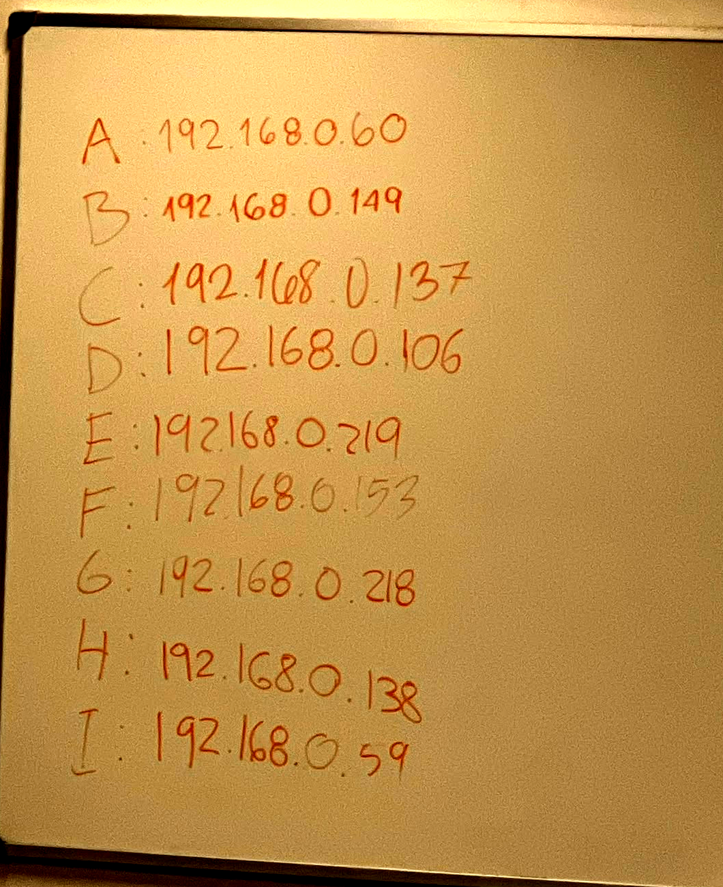
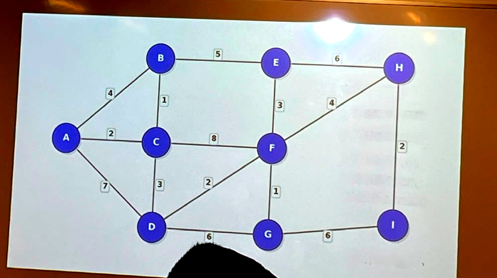
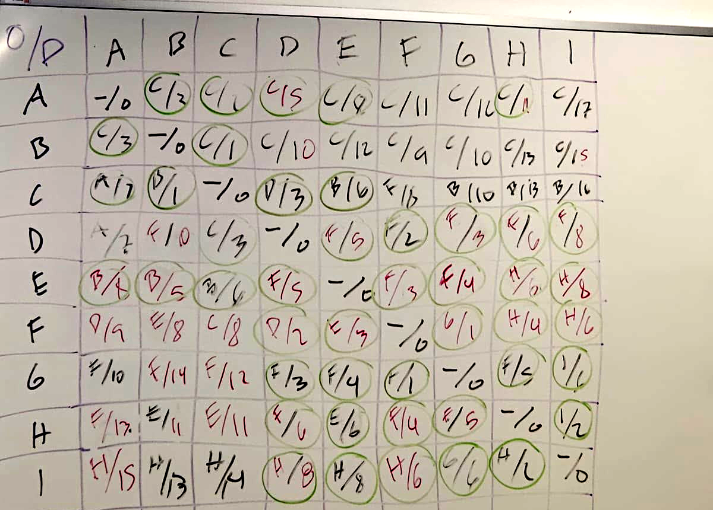

# Laboratorio 3 — Algoritmos de Enrutamiento

**Universidad del Valle de Guatemala**
**CC3067 — Redes**
**Fecha de entrega:** 3 de septiembre de 2026

**Integrantes del grupo:**

| Nombre | Carné |
| --- | --- |
| _Iris Ayala_ | _23965_ |
| _Jonatan Díaz_ | _23837_ |
| _Luis Padilla_ | _2366_ |
| _Anggie Quezada_ | _23643_ |

**Repositorio:** _https://github.com/Jonialen/cc3067-lab3-routing_

---

## 1. Descripción de la práctica

El laboratorio consiste en construir una red simulada en la que cada nodo es un
proceso independiente que se comunica con sus vecinos mediante sockets TCP.
Cada nodo conoce inicialmente solo a sus vecinos directos y debe construir su
tabla de enrutamiento para poder entregar mensajes a destinos con los que no
tiene un enlace directo.

Se implementaron tres algoritmos intercambiables sobre la misma infraestructura
de red:

1. **Dijkstra**, que calcula caminos mínimos a partir de una topología conocida.
2. **Flooding**, que reenvía cada paquete a todos sus vecinos.
3. **Link State Routing (LSR)**, que descubre la topología intercambiando
   anuncios de estado de enlace y luego aplica Dijkstra sobre ella.

La implementación se realizó en Go. La elección respondió a tres criterios: el
modelo de concurrencia mediante goroutines corresponde directamente a la
separación entre plano de forwarding y plano de ruteo que exige el enunciado; el
compilador produce un binario estático único, lo que resuelve la portabilidad
entre plataformas sin gestores de dependencias; y la biblioteca estándar cubre
sockets TCP y serialización JSON, por lo que el proyecto no tiene dependencias
externas.

---

## 2. Descripción de los algoritmos utilizados y su implementación

### 2.1 Arquitectura general

El enunciado señala que Dijkstra y Flooding se utilizan dentro de LSR y que por
ello se requiere alta modularidad. Este requisito determinó la arquitectura del
proyecto: ambos algoritmos se implementaron como **funciones puras**, sin
conocimiento alguno de sockets ni de paquetes en tránsito.

```go
func Dijkstra(g Graph, source string) Table
func Flood(neighbors []string, pkt *protocol.Packet) []string
```

De esta forma existe una sola implementación de cada algoritmo en todo el
proyecto. El modo `dijkstra` y el modo `flooding` invocan esas funciones
directamente, y LSR invoca las mismas: `Flood` para diseminar sus anuncios y
`Dijkstra` para derivar la tabla de forwarding a partir de la base de datos de
enlaces.

La organización del código es la siguiente:

```
cmd/node/            punto de entrada del proceso
internal/protocol/   envelope JSON y payload de estado de enlace
internal/transport/  servidor y cliente TCP
internal/config/     carga de topología y tabla de nombres
internal/routing/    plano de ruteo (grafo, flooding, algoritmos)
internal/node/       plano de forwarding y descubrimiento de vecinos
internal/cli/        consola interactiva
```

Cada algoritmo implementa la interfaz `Algorithm`, que aísla las decisiones de
ruteo del transporte:

```go
type Algorithm interface {
    Proto() protocol.Proto
    Start(ctx context.Context)
    Forward(pkt *protocol.Packet) []string
    HandleInfo(pkt *protocol.Packet)
    OnLinkUp(neighbor string, cost float64)
    OnLinkDown(neighbor string)
    Table() Table
}
```

El detalle relevante es que `Forward` devuelve una lista de vecinos. Esa firma
unifica flooding, que reenvía a varios destinos, con Dijkstra y LSR, que
reenvían a uno solo, sin que el plano de forwarding necesite distinguir entre
algoritmos.

Recíprocamente, el nodo expone a los algoritmos únicamente la interfaz
`Fabric` (`ID`, `Neighbors`, `SendTo`, `Logf`). Un algoritmo no puede abrir
conexiones ni conocer direcciones: solo decide hacia qué vecino lógico va un
paquete.

### 2.2 Concurrencia: los dos planos

El enunciado exige que forwarding y routing corran en paralelo. Ambos se
implementaron como goroutines que se comunican por canales, no por memoria
compartida:

- **Plano de forwarding.** Las goroutines de conexión decodifican cada línea
  JSON y depositan el paquete en un canal (`inbox`). Una única goroutine drena
  ese canal y procesa los paquetes. Con esto, un recálculo de rutas nunca
  bloquea un socket, y el manejo de paquetes no requiere candados propios.
- **Plano de ruteo.** Una goroutine sondea periódicamente a los vecinos
  mediante paquetes `hello` y declara caído al que deja de responder. El
  algoritmo activo recibe eventos `OnLinkUp` / `OnLinkDown` en lugar de
  consultar el estado.

La tabla de enrutamiento se protege con `SafeTable`, que utiliza un
`sync.RWMutex`: el plano de ruteo la reemplaza completa, el de forwarding la
consulta por paquete.

### 2.3 Protocolo

Cada paquete es un objeto JSON terminado en salto de línea sobre TCP (NDJSON),
UTF-8, con un máximo de 65536 bytes por línea. El delimitado por línea mantiene
el framing trivial y permite inspeccionar un nodo con `nc`.

Este formato fue negociado entre todos los grupos antes de la prueba en clase
(sección 3.6), y difiere del primer borrador interno del proyecto en tres
puntos: los campos `from`/`to` se escriben como `IP:puerto` en vez del id corto
de cada equipo, se agregaron `version` y `checksum`, y tres encabezados
cambiaron de nombre. La traducción entre el id corto (`A`, `B`, ...) que usa
internamente cada nodo y la dirección que exige el protocolo ocurre solo en la
frontera de red (al armar y al leer un paquete), por lo que Dijkstra, Flooding
y LSR no tuvieron que modificarse.

```json
{
  "version": 1,
  "proto": "lsr",
  "type": "message",
  "from": "192.168.0.128:5000",
  "to": "192.168.0.59:5000",
  "ttl": 16,
  "headers": [{"msg_id": "3f2a..."}, {"checksum": "0bded535"}, {"trace": ["192.168.0.128:5000"]}],
  "payload": "hola"
}
```

Tipos de paquete implementados:

| Tipo | Función |
| --- | --- |
| `hello` | Sondea a un vecino, con payload `{"listen_port": 5000}`; el receptor responde con `echo`. |
| `echo` | Devuelve el `t0` original para medir el viaje de ida y vuelta. |
| `info` | Transporta un paquete de estado de enlace (LSP): `{"origin", "seq", "age_s", "neighbors": [{"id","weight"}]}`. |
| `message` | Datos de usuario; se reenvía o se imprime al llegar a destino. |

Encabezados propios. Los encabezados desconocidos provenientes de otras
implementaciones se preservan intactos al reenviar un paquete, lo cual es
necesario para la interoperabilidad entre grupos.

| Encabezado | Propósito |
| --- | --- |
| `msg_id` | Identificador único, para descartar duplicados; si falta, se deriva de forma determinística de `(from,to,type,payload)`. |
| `checksum` | CRC32 (hex, 8 dígitos) del payload canónico; una discrepancia se registra pero nunca descarta el paquete. |
| `via` | Dirección del salto anterior, para no devolver el paquete por donde llegó. |
| `t0` | Timestamp del emisor, en segundos Unix fraccionarios, para medir el costo del enlace. |
| `trace` | Traza de las direcciones recorridas. |

El decodificador tolera paquetes de otros grupos que omitan campos: un paquete
sin `ttl` recibe el valor por defecto, uno sin `msg_id` recibe uno derivado
determinísticamente, y un `version` ausente o distinto de 1 se registra pero
nunca es motivo para descartar el paquete. De igual forma, el payload de un LSP
se acepta en las variantes que otros equipos puedan enviar (vecinos como
diccionario, la clave `links` en vez de `neighbors`, o el payload completo
serializado como texto), aunque este nodo siempre emite la forma canónica.

### 2.4 Dijkstra

**Entrada:** la topología completa (nodos y aristas), leída de un archivo de
configuración.

Se implementó con una cola de prioridad (`container/heap`), lo que da una
complejidad de O((V + E) log V) frente a O(V²) de la versión con búsqueda
lineal del mínimo.

La particularidad respecto a la formulación de libro es que una tabla de
enrutamiento no necesita el camino completo, sino únicamente el **primer
salto**. Por eso, además de las distancias, el algoritmo propaga `firstHop`:
cuando se relaja una arista desde el nodo origen, el primer salto es el vecino
mismo; en cualquier otro caso se hereda el primer salto del nodo desde el que se
llegó.

Los vecinos se recorren en orden alfabético al relajar aristas. Esto no afecta
la corrección, pero hace que la elección entre caminos de igual costo sea
reproducible entre ejecuciones y entre nodos, lo que facilita interpretar las
trazas.

En modo `dijkstra` la tabla se calcula una sola vez al arrancar. Aun así, el
nodo reacciona a fallas: al detectar que un vecino dejó de responder, poda sus
enlaces de la topología y recalcula, de modo que no se convierte en un agujero
negro para el tráfico.

### 2.5 Flooding

**Entrada:** únicamente el conocimiento de sus vecinos.

Cada paquete de datos se reenvía a todos los vecinos excepto a aquel del que se
recibió. No se mantiene tabla de enrutamiento alguna.

El problema central del flooding es la terminación: en una topología con ciclos
—como la utilizada en el laboratorio— el número de copias crece
exponencialmente. Se implementaron tres mecanismos independientes, porque en la
prueba en clase la red incluye implementaciones de otros grupos y no se puede
depender de un solo mecanismo:

1. **Caché de `msg_id`** (`SeenCache`). Un paquete ya procesado se descarta. Las
   entradas expiran tras un tiempo, de modo que una ejecución larga no consume
   memoria sin límite. Este es el mecanismo que efectivamente corta los ciclos.
2. **Números de secuencia**, aplicables a los anuncios de estado de enlace: un
   LSP cuya secuencia no supera a la almacenada no se vuelve a difundir.
3. **TTL**, un presupuesto fijo de saltos, como último recurso frente a un nodo
   externo con comportamiento incorrecto.

Adicionalmente se aplica *split horizon*: nunca se reenvía por el enlace del que
se recibió el paquete. No es necesario para la corrección, ya que la caché de
duplicados basta, pero reduce a la mitad el tráfico por enlace.

### 2.6 Link State Routing

**Entrada:** sus vecinos directos, y los anuncios de los demás nodos, de los
cuales se deriva la topología.

El ciclo de operación es el siguiente:

1. **Descubrimiento.** El nodo envía `hello` a sus vecinos configurados. El
   receptor responde con `echo` devolviendo el `sent_at` original, lo que
   permite al emisor medir el viaje de ida y vuelta sin mantener estado por
   sonda. El costo del enlace es la mitad de ese tiempo, es decir el retardo en
   un sentido.
2. **Anuncio.** El nodo construye un *link state packet* con su identificador,
   un número de secuencia y el conjunto de sus vecinos con sus costos. Solo
   anuncia lo que puede medir directamente, que es la propiedad que define a un
   protocolo de estado de enlace.
3. **Difusión.** El LSP se disemina con la función `Flood`, la misma que utiliza
   el modo flooding.
4. **Base de datos.** Cada nodo almacena el anuncio más reciente de cada origen.
   Un anuncio con secuencia menor o igual a la almacenada se descarta y no se
   redifunde; este es el mecanismo que hace converger la difusión.
5. **Cálculo.** Con la topología reconstruida a partir de la base de datos se
   invoca `Dijkstra`, obteniendo la tabla de forwarding.
6. **Envejecimiento.** Los anuncios se refrescan periódicamente. Un anuncio que
   deja de refrescarse expira y su origen se elimina de la topología, que es
   como se detecta la caída de un nodo no adyacente.

#### Control del tráfico de señalización

Durante las pruebas se detectó un defecto de diseño que solo se manifiesta con
la red completa en ejecución. Los costos de enlace provienen de mediciones
reales, y en un enlace rápido el tiempo de ida y vuelta varía más del 50 % entre
una sonda y la siguiente. Como la condición inicial para reanunciar era un
cambio relativo del 25 %, cada nodo reanunciaba su estado en cada `hello`,
generando una tormenta de paquetes de control que crece con el tamaño de la red.

Se corrigió con dos mecanismos:

1. **Suavizado.** El plano de descubrimiento mantiene un promedio móvil
   exponencial del tiempo de ida y vuelta de cada enlace, de modo que una
   muestra ruidosa no altera significativamente el costo.
2. **Política de anuncio.** La aparición o desaparición de un vecino es un
   cambio de topología y se difunde de inmediato. Un costo que solo fluctuó se
   anuncia únicamente si superó un umbral y nunca con más frecuencia que el
   límite de tasa establecido; el refresco periódico lo transporta de todos
   modos.

El efecto se midió sobre la red de nueve nodos en contenedores y se documenta en
la sección de resultados.

---

## 3. Resultados

### 3.1 Entorno de pruebas

Las pruebas se ejecutaron en tres entornos:

1. **Suite automatizada.** Pruebas unitarias de los algoritmos y pruebas de
   integración que levantan nodos reales sobre sockets de loopback. Se ejecutan
   con `make test` y bajo el detector de condiciones de carrera con `make race`.
2. **Nueve procesos locales**, uno por nodo, sobre la topología de referencia.
3. **Nueve contenedores Docker**, uno por nodo, sobre una red bridge privada.
   Cada nodo tiene su propia pila de red y su propia dirección, lo que se
   aproxima a la prueba en clase.

Topología de referencia utilizada:

```
A — B — D — E
|  /|   |   |
| / |   |   |
C   |   F — G — I
 \  |  /|      /
  \ | / |     /
    ·   H ———
```

Adyacencias: A(B,C) B(A,C,D) C(A,B,F) D(B,E,F) E(D,G) F(C,D,G,H) G(E,F,I)
H(F,I) I(G,H).

### 3.2 Convergencia y enrutamiento en LSR

Partiendo de nodos que solo conocen a sus vecinos, la red converge y el tráfico
sigue el camino de menor costo:

```
[I] MESSAGE from A (path A>C>F>G): hola-multi-hop
```

El nodo A nunca fue informado de la existencia de I; aprendió la ruta
exclusivamente a partir de los anuncios difundidos.

### 3.3 Entrega única bajo flooding

Sobre la misma topología, que contiene ciclos, un mensaje enviado en modo
flooding se entrega exactamente una vez:

```
[I] MESSAGE from A (path A>B>D>E>G): flood-test
```

La prueba de integración `TestFloodingDeliversExactlyOnceDespiteACycle` verifica
además que no llegue una segunda copia dentro de una ventana de espera.

### 3.4 Reacción ante la caída de un router

Se detuvo el contenedor del nodo F, que formaba parte de la ruta activa hacia I,
y se reenvió el mensaje tras la convergencia:

| Momento | Ruta observada | Siguiente salto desde A |
| --- | --- | --- |
| Antes de la falla | `A>C>F>H` | C |
| Después de la falla | `A>B>D>E>G` | B |

El nodo A registró la retirada de los enlaces hacia F por parte de C, D, G y H,
y posteriormente la expiración del anuncio del propio F:

```
[A] topology update: C is linked to [A B]
[A] topology update: D is linked to [B E]
[A] topology update: G is linked to [E I]
[A] link-state packet of F expired, removing it from the topology
```

Al reiniciar el contenedor, F fue reincorporado a la topología.

### 3.5 Tráfico de control

Medición del número de secuencia alcanzado por los anuncios, como indicador
directo del volumen de señalización:

| Versión | Tiempo de ejecución | Secuencia máxima observada |
| --- | --- | --- |
| Antes de la corrección | 60 s | 85 |
| Después de la corrección | 90 s | 12 |

Con un refresco periódico de 8 segundos, 90 segundos de ejecución corresponden a
aproximadamente 11 anuncios por nodo. Es decir, tras la corrección el tráfico de
control equivale al refresco diseñado y nada más.

Estado de la base de datos de enlaces del nodo A tras la corrección:

```
B  seq=11   A(0.13) C(0.12) D(0.12)
C  seq=11   A(0.14) B(0.10) F(0.09)
D  seq=11   B(0.11) E(0.14) F(0.13)
E  seq=10   D(0.11) G(0.11)
F  seq=12   C(0.11) D(0.12) G(0.12) H(0.12)
G  seq=11   E(0.11) F(0.11) I(0.11)
H  seq=10   F(0.17) I(0.15)
I  seq=10   G(0.16) H(0.12)
```

### 3.6 Interconexión en clase

La prueba conjunta usó una red de nueve grupos, identificados `A`–`I`, sobre la
red inalámbrica del salón. Cada grupo corrió su propio nodo en modo `lsr` y
solo configuró la fila correspondiente a su propio id: ni la topología completa
ni las direcciones de los demás grupos son necesarias para que LSR funcione,
ya que la topología se termina de aprender por difusión de anuncios de estado
de enlace (ver 2.6).

**Direcciones IP asignadas.** Cada grupo comunicó la IP en la que su nodo
escucha (puerto 5000 para todos). Quedaron registradas en el pizarrón
(Figura 1) y configuradas en `configs/names-class.json`:

| Grupo | Registrado en el pizarrón | Configurado en `names-class.json` |
| --- | --- | --- |
| A | 192.168.0.60 | 192.168.0.60:5000 |
| B (nuestro grupo) | 192.168.0.149 | **192.168.0.128:5000** |
| C | 192.168.0.137 | 192.168.0.137:5000 |
| D | 192.168.0.106 | **192.168.0.155:5000** |
| E | 192.168.0.219 | 192.168.0.219:5000 |
| F | 192.168.0.153 | 192.168.0.153:5000 |
| G | 192.168.0.218 | 192.168.0.218:5000 |
| H | 192.168.0.138 | 192.168.0.138:5000 |
| I | 192.168.0.59 | 192.168.0.59:5000 |

Siete de las nueve entradas coinciden. En las dos que no —B y D, resaltadas— la
dirección correcta era la de nuestra configuración: **el pizarrón estaba
desactualizado en ambos casos**. B es nuestro propio nodo, de modo que conocemos
su dirección de primera mano; la de D se confirmó con el grupo correspondiente.
Esas dos entradas obsoletas resultaron ser la causa de la falla, y se analizan
en la sección 3.7.

{ width=48% }

**Topología acordada.** La cátedra proyectó el mapa de conexiones de referencia
para los nueve grupos (Figura 2), con el costo de cada enlace ya fijado:

{ width=95% }

A cada grupo le correspondía configurar únicamente su propia fila de esa
topología. Al grupo B le tocaron los vecinos A, C y E, con costo 4, 1 y 5
respectivamente (`configs/topo-class.json`) — exactamente la adyacencia de B en
la Figura 2. El grafo completo (`configs/topo-weighted.json`, transcrito de la
misma figura para poder correr el modo `dijkstra` de forma aislada) es:

| Nodo | Vecinos (costo) |
| --- | --- |
| A | B(4), C(2), D(7) |
| B | A(4), C(1), E(5) |
| C | A(2), B(1), D(3), F(8) |
| D | A(7), C(3), F(2), G(6) |
| E | B(5), F(3), H(6) |
| F | C(8), D(2), E(3), G(1), H(4) |
| G | D(6), F(1), I(6) |
| H | E(6), F(4), I(2) |
| I | G(6), H(2) |

En modo `lsr` (el usado en la prueba) ningún grupo necesitó conocer esta tabla
completa: cada uno solo configuró su propia fila, y el resto se aprendió por
difusión de anuncios de estado de enlace, que es precisamente la propiedad que
LSR explota.

**Ajustes al protocolo negociados entre equipos.** El formato base sugerido por
la cátedra (sección 3.2 del enunciado) se refinó entre grupos hasta la versión
descrita en 2.3: `from`/`to` como `IP:puerto`, `version`, `checksum` CRC32 del
payload canónico, y los encabezados `via`/`t0`/`trace`. Nuestra implementación
inicial usaba nombres distintos para varios de estos campos (id corto en vez de
dirección, `hop`/`sent_at`/`path`, sin `checksum` ni `version`); se corrigió el
mismo día de la prueba para cumplir el acuerdo final, aislando la traducción
id↔dirección en la frontera de red para no tocar los algoritmos de ruteo.

**Resultados de la interconexión.** Como verificación cruzada, al final de la
prueba el grupo consolidó en el pizarrón la matriz de enrutamiento completa de
la red —para cada par origen/destino, el siguiente salto y el costo total
(Figura 3)—. Esa matriz es el insumo que permite el análisis de la subsección
siguiente, porque hace visible algo que ningún nodo puede ver por sí solo: si
las nueve implementaciones convergieron o no a la misma topología.

Como referencia de contraste, la tabla que produce Dijkstra sobre la topología
acordada de la Figura 2 —el resultado que las nueve implementaciones deberían
haber alcanzado— es la siguiente, en formato `siguiente salto / costo`:

| Origen ↓ / Destino → | A | B | C | D | E | F | G | H | I |
| --- | --- | --- | --- | --- | --- | --- | --- | --- | --- |
| **A** | –/0 | C/3 | C/2 | C/5 | C/8 | C/7 | C/8 | C/11 | C/13 |
| **B** | C/3 | –/0 | C/1 | C/4 | E/5 | C/6 | C/7 | C/10 | C/12 |
| **C** | A/2 | B/1 | –/0 | D/3 | B/6 | D/5 | D/6 | D/9 | D/11 |
| **D** | C/5 | C/4 | C/3 | –/0 | F/5 | F/2 | F/3 | F/6 | F/8 |
| **E** | B/8 | B/5 | B/6 | F/5 | –/0 | F/3 | F/4 | H/6 | H/8 |
| **F** | D/7 | D/6 | D/5 | D/2 | E/3 | –/0 | G/1 | H/4 | H/6 |
| **G** | F/8 | F/7 | F/6 | F/3 | F/4 | F/1 | –/0 | F/5 | I/6 |
| **H** | F/11 | F/10 | F/9 | F/6 | E/6 | F/4 | F/5 | –/0 | I/2 |
| **I** | H/13 | H/12 | H/11 | H/8 | H/8 | H/6 | G/6 | H/2 | –/0 |

{ width=88% }

> _(Foto de pizarrón; letra manuscrita. Las celdas citadas textualmente en el
> análisis siguiente corresponden a la fila B, verificada contra la imagen.)_

**Incompatibilidades encontradas.** La primera fue de formato, no de
comportamiento: antes de acordar el protocolo final, nuestro nodo enviaba
`from`/`to` como el id corto de topología en vez de la dirección IP, por lo que
un nodo de otro equipo no podía interpretar a quién iba dirigido un paquete
nuestro. Se resolvió adoptando `IP:puerto` en el borde de red, sin cambiar la
lógica interna de enrutamiento (sección 2.3). La segunda no fue de formato sino
de estado —direcciones desactualizadas y enlaces que nunca subieron— y es la que
se analiza a continuación.

### 3.7 Análisis de la falla: por qué todo el tráfico de B salió por C

La prueba en clase no alcanzó una convergencia correcta, y la matriz del
pizarrón permite identificar la causa con precisión en lugar de conjeturarla.

**El síntoma.** La fila correspondiente a nuestro nodo B en la matriz
consolidada (Figura 3) tiene el siguiente salto `C` en **todas** sus celdas, y
costos sistemáticamente mayores a los de la tabla de referencia:

| Fila B, destino → | A | B | C | D | E | F | G | H | I |
| --- | --- | --- | --- | --- | --- | --- | --- | --- | --- |
| Observada (pizarrón) | C/3 | –/0 | C/1 | C/10 | C/12 | C/9 | C/10 | C/13 | C/15 |
| Esperada (Dijkstra) | C/3 | –/0 | C/1 | C/4 | **E**/5 | C/6 | C/7 | C/10 | C/12 |

Dos celdas bastan para probar que la tabla observada no corresponde a la
topología acordada. La primera es el destino E: B tiene un enlace **directo** a
E de peso 5, de modo que ninguna ejecución correcta de Dijkstra puede asignarle
costo 12 ni un siguiente salto distinto de E. La segunda es el destino D: el
camino B→C→D cuesta 1+3 = 4, y la tabla reporta 10.

**La causa.** Un costo de 10 hacia D corresponde exactamente al camino
B→C→A→D (1+2+7). Es decir, la ruta rodeó por A en vez de usar el enlace C–D.
Partiendo de esa pista se puede reconstruir qué grafo produce la fila
observada: al eliminar las aristas **B–E** y **C–D** de la topología de la
Figura 2 y volver a ejecutar Dijkstra desde B, el resultado reproduce la fila
del pizarrón **en las nueve celdas, incluyendo los nueve siguientes saltos**:

```
sin B-E ni C-D:   A:C/3  B:-/0  C:C/1  D:C/10  E:C/12
                  F:C/9  G:C/10  H:C/13  I:C/15
```

Una coincidencia de nueve celdas no es casual. La conclusión es que **la base de
datos de estado de enlace de nuestro nodo carecía de dos aristas**: su propio
enlace hacia E, y el enlace C–D. Con esas dos ausencias, C quedó como el único
vecino vivo de B y como su única salida hacia el resto de la red, que es
precisamente el comportamiento que se observó durante la prueba.

Conviene ser preciso sobre el rol de C, porque el síntoma invita a una
conclusión equivocada. **C no falló**: fue el único enlace que sí funcionó. Lo
que falló fue todo lo demás alrededor de C. La ausencia del enlace C–D en
nuestra vista significa que el anuncio de estado de enlace de C, tal como
nuestro nodo lo recibió y almacenó, no declaraba a D entre sus vecinos —ya sea
porque C tampoco había logrado establecer ese enlace, o porque el anuncio que
nos llegó estaba incompleto—. La matriz del pizarrón respalda la primera
lectura solo parcialmente: otras filas sí reflejan el enlace C–D, lo que indica
que **distintos nodos tenían vistas distintas del mismo grafo**. Esa
discrepancia entre filas es, en sí misma, el hallazgo central de la prueba.

**El mecanismo, y por qué es silencioso.** El descubrimiento de vecinos
(`internal/node/discovery.go`) marca vivo a un vecino únicamente cuando este
responde un `hello` con un `echo`. Sin ese viaje de ida y vuelta completo no se
dispara `OnLinkUp`, y en consecuencia el enlace **no entra en el anuncio de
estado de enlace que el nodo emite**. Aquí está lo importante: un enlace que
nunca sube no genera ningún error. No hay excepción, no hay paquete rechazado,
no hay entrada de bitácora que grite. Simplemente hay una arista menos en el
grafo, y Dijkstra —que es correcto— calcula obedientemente el camino óptimo
sobre un grafo equivocado. El resultado es una tabla de enrutamiento
perfectamente consistente consigo misma y distinta de la del vecino. Cuando dos
nodos adyacentes discrepan sobre qué aristas existen, un paquete puede ser
enviado a un salto que no tiene ruta de retorno y desaparecer sin dejar rastro.

**El origen: una dirección IP desactualizada.** El pizarrón registró a
B en `192.168.0.149`, mientras que la tabla de nombres con la que efectivamente
corrimos declara `192.168.0.128`. Las direcciones se asignan por DHCP sobre la
red inalámbrica del salón, y una renovación de concesión durante la sesión
cambia la dirección sin avisar a nadie. Lo relevante es la asimetría que esto
produce: nuestro nodo tenía correctas las direcciones de sus tres vecinos —A
(.60), C (.137) y E (.219) coinciden con el pizarrón—, de modo que **nuestros
`hello` salían bien**; pero cualquier grupo que resolviera a B desde el pizarrón
enviaba su `echo` a `.149`, una dirección que ya no era la nuestra. El viaje de
ida y vuelta nunca se cerraba y el enlace jamás subía, **aunque la conectividad
existiera en un sentido**. Esta es exactamente la forma de falla que produce el
grafo asimétrico reconstruido arriba, y explica que un vecino sí funcionara: le
basta con haber respondido a la dirección del campo `from` del paquete recibido,
en vez de a la que tenía configurada en su tabla de nombres.

**La segunda arista, y por qué el origen es el mismo.** Falta explicar la
ausencia del enlace C–D, que no es vecino nuestro y por lo tanto no depende de
nuestro descubrimiento. La explicación está en la otra entrada obsoleta del
pizarrón y en un detalle de la implementación.

El detalle es que `Graph.AddEdge` (`internal/routing/graph.go`) registra
aristas **dirigidas**: al reconstruir la topología, `recompute` recorre la base
de datos y, por cada anuncio, agrega únicamente las aristas que salen de su
origen. Un enlace C→D solo existe en nuestro grafo si **C lo declara**; que D
declare a C agrega la arista D→C, que es la dirección contraria y no sirve para
que un paquete salga de B hacia D.

La cadena causal es entonces directa. El pizarrón registraba a D en `.106`
cuando D escuchaba en `.155`. C, que sí es vecino de D en el mapa acordado,
resolvía a D desde esa dirección obsoleta: sus `hello` iban a una dirección
vacía, nunca recibía `echo`, nunca disparaba `OnLinkUp("D")` y en consecuencia
**su anuncio de estado de enlace no incluía a D**. Nuestro nodo recibió ese
anuncio incompleto, lo almacenó tal cual —correctamente, porque es lo único que
C decía saber— y calculó Dijkstra sobre un grafo sin la arista C→D.

Las dos aristas faltantes tienen por lo tanto **un único origen**: dos entradas
desactualizadas en la tabla de direcciones. La de B rompió nuestro propio enlace
con E; la de D rompió el enlace de C con D, y de rebote nuestra vista de la
topología. Ninguna de las dos produjo un error en ningún nodo: produjeron
anuncios que eran honestos —cada nodo anunció exactamente lo que podía medir— y
sin embargo describían una red que no era la acordada.

**Tiempo de convergencia.** Por lo anterior no se obtuvo una medición útil del
tiempo de convergencia de los nueve grupos: la red no alcanzó un estado en el
que los nueve anuncios estuvieran presentes y fueran mutuamente consistentes, de
modo que no existe un instante de convergencia que medir. Como referencia del
comportamiento esperado, en el entorno controlado de nueve contenedores
(sección 3.1) —misma cantidad de nodos, mismo intervalo de `hello`, mismo
código— la topología completa queda visible en el comando `topology` de
cualquier nodo pocos segundos después del arranque, dominada por el intervalo de
sondeo y no por el cálculo de rutas. La diferencia entre ambos entornos no está
en el algoritmo, sino en que en uno las direcciones son estables y en el otro no.

**Cómo se habría detectado en el momento.** Las tres verificaciones que habrían
acotado el problema, y que quedan como recomendación operativa:

1. Confirmar conectividad TCP hacia cada vecino con `nc <ip> 5000` **antes** de
   levantar los nodos, y en ambos sentidos. Un enlace que no pasa esa prueba no
   va a aparecer en ninguna topología.
2. Contrastar el comando de consola `neighbors` contra la fila configurada. Todo
   vecino ausente de esa lista es un enlace que el nodo no está anunciando, y por
   lo tanto una arista que el resto de la red no verá.
3. Comparar el comando `topology` entre dos grupos cualesquiera. Una arista
   presente en uno y ausente en el otro identifica la asimetría de inmediato, que
   es justamente lo que la matriz del pizarrón reveló, pero recién al final.

Las tres son baratas. La lección es que en una red distribuida el estado que hay
que verificar primero no es el propio, sino el acuerdo entre pares.

---

## 4. Discusión

### 4.1 Comparación entre los algoritmos

| | Información requerida | Tabla | Tráfico de datos | Reacción a fallas |
| --- | --- | --- | --- | --- |
| Dijkstra | Topología completa | Calculada al arrancar | Mínimo, una copia por camino | Poda vecinos caídos |
| Flooding | Solo vecinos | Ninguna | Alto, crece con las aristas | Deja de usar el enlace mudo |
| LSR | Vecinos, luego topología aprendida | Recalculada ante cambios | Mínimo en datos, moderado en control | Reanuncia, envejece y recalcula |

Flooding es el único que funciona sin ninguna información previa, y por eso es
el mecanismo de arranque de LSR: antes de conocer la topología no existe forma
de dirigir un anuncio hacia un destino específico. Su costo es que el tráfico de
datos crece con el número de aristas, lo que lo hace inviable como algoritmo de
red general.

Dijkstra produce el enrutamiento óptimo con el mínimo tráfico, pero exige que
alguien le entregue la topología completa, lo cual no es realista en una red que
cambia.

LSR resuelve esa tensión: usa flooding solo para el tráfico de control, que es
acotado y periódico, y usa Dijkstra sobre la topología resultante para el
tráfico de datos, que es el volumen realmente significativo.

### 4.2 Sobre la modularidad

La decisión de implementar Dijkstra y Flooding como funciones puras tuvo un
efecto verificable: las pruebas unitarias de ambos algoritmos no requieren
sockets, procesos ni temporizadores, y las pruebas de LSR ejercitan exactamente
el mismo código que se ejecuta en producción. Si se hubieran escrito como dos
programas separados con lógica duplicada, cualquier corrección en uno habría
tenido que replicarse manualmente en el otro.

### 4.3 Sobre la medición de costos

Medir el costo de un enlace con el tiempo real de ida y vuelta es más realista
que asignar pesos fijos, pero introduce el problema descrito en la sección 2.6:
la señalización pasa a depender del ruido de medición. Esta es una diferencia
importante entre implementar un algoritmo sobre un grafo estático y operarlo
sobre una red real, y no se manifestó en las pruebas unitarias sino únicamente
al ejecutar la red completa.

### 4.4 Limitaciones

- El TTL por defecto es de 8 saltos. En una red mayor que la del laboratorio
  habría que aumentarlo.
- Los costos se miden en milisegundos de retardo; no se considera ancho de banda
  ni pérdida de paquetes.
- No se implementó autenticación de los anuncios: un nodo malicioso podría
  anunciar enlaces inexistentes y atraer tráfico.
- La detección de caída depende de que el vecino deje de responder. Un enlace
  que responde pero descarta datos no se detecta.
- La topología se arma con aristas dirigidas: un enlace solo es utilizable en el
  sentido en que su origen lo anuncia. Esto es correcto —un nodo no debe afirmar
  lo que no midió— pero implica que un enlace anunciado por un solo extremo
  queda inutilizable en la práctica sin que ningún nodo lo reporte como
  anomalía. A raíz de esta práctica se implementaron dos diagnósticos que
  cubren el vacío; se describen en la sección 4.5.

### 4.5 Diagnósticos incorporados a partir de esta práctica

La falla de la sección 3.7 no se detectó durante la prueba porque el nodo no
tenía forma de decir en voz alta lo que le faltaba. A partir de ella se
agregaron dos chequeos. Son complementarios y **ninguno subsume al otro**, lo
cual es el punto más interesante de los dos.

**Chequeo de simetría de la topología** (`Asymmetries`, en
`internal/routing/symmetry.go`). Recorre exactamente el mismo conjunto de
aristas que `recompute` le entrega a Dijkstra y reporta los enlaces que un
extremo declara y el otro no. Es la inconsistencia clásica de una red de estado
de enlace: el enlace es utilizable en un solo sentido, los dos nodos calculan
tablas distintas, y ninguno de los dos comete ningún error. Un nodo del que no
se ha recibido ningún anuncio se excluye deliberadamente del reporte: no
contribuye aristas salientes, y no se puede distinguir un enlace que se niega a
declarar de uno cuyo anuncio todavía no llegó.

**Chequeo de vecinos silenciosos** (`SilentNeighbors`, en
`internal/node/discovery.go`). Compara la fila de topología configurada contra
lo que el descubrimiento realmente observó, y nombra a los vecinos que nunca
respondieron un solo `hello`.

Este segundo chequeo es el que habría detectado nuestra falla, y la razón
merece precisión: **el chequeo de simetría no la habría encontrado**. Cuando los
dos extremos fallan en establecer el enlace —que es lo que ocurrió con B–E, y
lo más probable con C–D— ninguno de los dos lo declara, y el grafo resultante es
perfectamente simétrico. No hay contradicción entre anuncios que detectar: hay
una arista que sencillamente no está, y se ve consistente desde todos los
ángulos. El único nodo capaz de notarlo es aquel que sabía que el enlace debía
existir, porque lo tiene en su configuración y nunca subió.

El chequeo de simetría sigue siendo necesario para el caso complementario: si el
anuncio de D sí hubiera llegado declarando a C mientras C no declaraba a D, la
contradicción habría quedado a la vista de inmediato.

Ambos se ejecutan solos —el de vecinos silenciosos tras unos pocos intervalos de
sondeo, el de simetría tras un período de gracia que evita reportar la
asimetría transitoria de todo arranque— y cada hallazgo se informa una sola vez,
rearmándose si se resuelve y vuelve a aparecer. El comando de consola `check`
los ejecuta a demanda:

```
B> check
configured neighbours that never answered a hello:
  E                check that its address is current and that it is running
links declared by only one endpoint:
  C -> D (cost 3.00): D does not declare it back
```

Es una cantidad de código muy pequeña frente al tiempo que costó diagnosticar el
problema sin ella. Esa desproporción es la lección práctica: en un sistema
distribuido conviene invertir en observabilidad del **desacuerdo entre nodos**,
no solo del estado de cada nodo, porque el estado propio siempre se ve sano.

---

## 5. Conclusiones

1. Los tres algoritmos se implementaron y verificaron sobre una red de nueve
   nodos, tanto en procesos locales como en contenedores independientes.
2. Tratar Dijkstra y Flooding como funciones puras, y no como programas
   separados, permitió que LSR los reutilizara literalmente. Existe una sola
   implementación de cada algoritmo en el proyecto.
3. La terminación del flooding depende de la detección de duplicados, no del
   TTL. El TTL es una protección de último recurso frente a implementaciones
   externas incorrectas.
4. LSR converge desde el desconocimiento total de la topología y se recupera de
   la caída de un router intermedio sin intervención manual.
5. El problema de mayor impacto encontrado no fue algorítmico sino operativo: el
   ruido de las mediciones de costo generaba una tormenta de señalización. Solo
   se hizo evidente al ejecutar la red completa, lo que muestra que las pruebas
   unitarias son necesarias pero no suficientes para un sistema distribuido.
6. En la prueba de interconexión en clase la limitante tampoco fue algorítmica.
   La matriz consolidada en el pizarrón permitió reconstruir la causa: la fila
   de nuestro nodo coincide en sus nueve celdas con Dijkstra ejecutado sobre la
   topología acordada **menos las aristas B–E y C–D**, es decir, sobre un grafo
   al que le faltaban dos enlaces que sí existían en el mapa. Ambas ausencias
   tienen un único origen: dos direcciones IP desactualizadas en la tabla
   registrada en el pizarrón —B anotado en `.149` cuando escuchaba en `.128`, y
   D en `.106` cuando escuchaba en `.155`—. Una dirección obsoleta impide cerrar
   el viaje de ida y vuelta del descubrimiento aunque exista conectividad, el
   enlace nunca sube, y el nodo deja de anunciarlo. Dos entradas mal en una
   tabla de nueve bastaron para romper la convergencia de toda la red.
7. La lección de fondo es que un algoritmo de estado de enlace es exactamente
   tan correcto como su plano de descubrimiento. Una arista que no se puede
   sondear no existe para el algoritmo, y su ausencia no se manifiesta como un
   error: se manifiesta como una tabla de enrutamiento internamente consistente,
   calculada sin fallos, y distinta de la del vecino. Ese es el modo de falla
   más peligroso de un sistema distribuido, porque no hay nada que depurar en el
   código —el código está bien— sino un desacuerdo entre nodos que ningún nodo
   puede observar por sí mismo.

---

## 6. Comentarios

**Sobre la práctica.** El laboratorio tiene una separación clara entre dos
dificultades de naturaleza distinta. Implementar los tres algoritmos sobre un
grafo en memoria es un ejercicio acotado y verificable con pruebas unitarias.
Operarlos sobre una red real, con nueve implementaciones independientes
escritas por equipos distintos, es un problema de otra categoría: los defectos
que aparecieron ahí no fueron errores de Dijkstra ni de flooding, sino
desacuerdos sobre el formato del sobre, direcciones que dejaron de ser válidas
y enlaces que existían en el mapa pero no en la red.

**Principales dificultades encontradas.**

1. **Acuerdo tardío sobre el protocolo.** El enunciado entrega un formato base y
   deja a los grupos cerrar los detalles. Ese cierre ocurrió el mismo día de la
   prueba, lo que obligó a modificar la capa de serialización con la red ya
   levantada. Que la traducción id↔dirección estuviera aislada en la frontera de
   red fue lo que permitió hacer el cambio sin tocar los algoritmos; de haber
   usado la dirección IP como identificador interno, el cambio habría atravesado
   todo el proyecto.
2. **Direcciones IP inestables.** Las direcciones se asignan por DHCP sobre la
   red inalámbrica del salón. Una renovación de concesión durante la sesión
   cambia la dirección de un nodo y deja obsoleta la tabla de nombres que los
   demás grupos ya configuraron, sin que nadie reciba ningún aviso: el síntoma
   es simplemente un vecino que dejó de responder. La evidencia es directa: el
   pizarrón registró a nuestro nodo en `.149` y a D en `.106`, cuando las
   direcciones reales eran `.128` y `.155`. Siete de nueve entradas eran
   correctas; las dos que no bastaron para romper la convergencia de toda la
   red. El agravante es que el pizarrón es un registro estático de un dato
   dinámico: se escribe una vez al inicio y nadie se entera cuando deja de ser
   cierto.
3. **Los enlaces que nunca subieron** (sección 3.7). Fue la dificultad de mayor
   impacto y la más difícil de diagnosticar. Durante la prueba el síntoma era
   que todo el tráfico salía por C, lo que naturalmente hizo sospechar de C; el
   análisis posterior de la matriz del pizarrón mostró lo contrario: C era el
   único enlace que funcionaba. Diagnosticar hacia atrás desde una tabla de
   enrutamiento resultó mucho más informativo que observar el comportamiento en
   vivo, porque la tabla es el residuo exacto del grafo que el nodo creía tener.
4. **Ausencia de un observador global.** Cada grupo solo ve su propia tabla. Sin
   una vista consolidada es imposible distinguir "mi nodo está mal" de "el
   vecino no levantó". La consolidación manual en el pizarrón (Figura 3) suplió
   esa carencia, pero solo después de terminada la prueba.

**Sugerencias.**

- Fijar y publicar el protocolo por escrito con al menos una sesión de
  anticipación, junto con un paquete de ejemplo válido contra el cual cada grupo
  pueda validar su decodificador antes de llegar a clase.
- Asignar direcciones IP estáticas, o reservar la concesión DHCP por dirección
  MAC, para eliminar la clase completa de fallas descrita en el punto 2.
- Dedicar los primeros minutos de la prueba a una verificación de conectividad
  por pares (`nc <ip> 5000` hacia cada vecino) antes de levantar los nodos. Una
  arista que no pasa esa prueba no va a aparecer en ninguna topología, y
  detectarlo en ese momento cuesta segundos en vez de toda la sesión.
- Acordar un comando de consola común y obligatorio —por ejemplo `topology`—
  para que dos grupos cualesquiera puedan comparar su vista del grafo en el
  momento y localizar asimetrías sin recurrir a la transcripción manual.

---

## 7. Referencias

1. Tanenbaum, A. S., & Wetherall, D. J. (2011). *Computer Networks* (5.ª ed.).
   Prentice Hall. Capítulo 5: The Network Layer.
2. Kurose, J. F., & Ross, K. W. (2016). *Computer Networking: A Top-Down
   Approach* (7.ª ed.). Pearson. Capítulo 5: The Network Layer — Control Plane.
3. Dijkstra, E. W. (1959). A note on two problems in connexion with graphs.
   *Numerische Mathematik*, 1(1), 269–271.
4. Moy, J. (1998). *OSPF Version 2* (RFC 2328). Internet Engineering Task Force.
   https://www.rfc-editor.org/rfc/rfc2328
5. The Go Authors. *The Go Programming Language Specification*.
   https://go.dev/ref/spec
